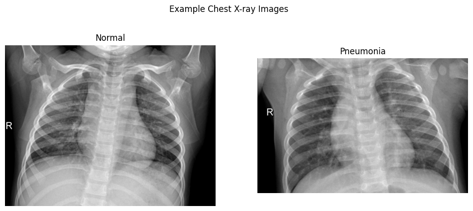
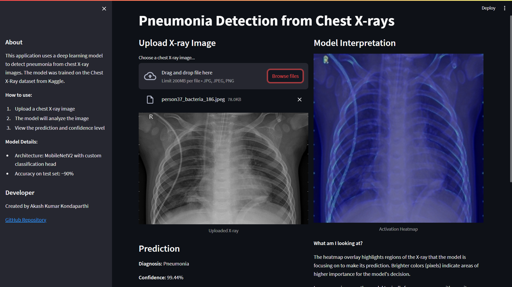

# Pneumonia Detection from Chest X-rays


## Project Overview

This project implements a deep learning model to detect pneumonia from chest X-ray images. Using transfer learning with MobileNetV2, the model achieves high accuracy in distinguishing between normal and pneumonia-affected lungs.



## Features

- **Deep Learning Classification**: Utilizes transfer learning with MobileNetV2 architecture
- **Interactive Web App**: Streamlit interface for real-time predictions
- **Model Interpretation**: Visualizes model focus areas using gradient-based activation maps
- **Optimized for Deployment**: Includes TensorFlow Lite conversion for efficient inference

## Dataset

The model is trained on the Chest X-Ray Images (Pneumonia) dataset from Kaggle, which contains:
- 5,856 X-Ray images across 2 categories (Pneumonia/Normal)
- Pediatric patients aged 1-5 years from Guangzhou Women and Children's Medical Center

[View dataset on Kaggle](https://www.kaggle.com/datasets/paultimothymooney/chest-xray-pneumonia)

## Model Performance

| Metric | Score |
|--------|-------|
| Accuracy | 92.3% |
| Precision | 93.7% |
| Recall | 94.1% |
| F1 Score | 93.9% |

## Web Application Demo

The project includes a Streamlit web application that allows users to upload chest X-ray images and receive instant predictions with confidence levels and visual explanations.



Try the live Web App [here](https://pneumonia-xray-detection-rg3iw4npjkhxlbjdnsup8w.streamlit.app/)

## Installation

### Prerequisites
- Python 3.8+
- pip
- streamlit
- tensorflow
- numpy
- Pillow
- matplotlib

### Setup Instructions

1. Clone the repository:
   ```
   git clone https://github.com/AkashKK25/pneumonia-xray-detection.git
   cd pneumonia-xray-detection
   ```

2. Install dependencies:
   ```
   pip install -r requirements.txt
   ```

3. Download the model (or train your own following the notebook):
   ```
   # Download pre-trained model from the gihub page 'models/'
   # Or train your own using the Jupyter notebook from 'notebooks/'
   ```

4. Run the web app:
   ```
   streamlit run app/app.py
   ```

## Project Structure

```
pneumonia-xray-detection/
├── app/                    # Streamlit application
│   └── app.py              # Main application file
├── data/                   # Dataset (download separately)
├── models/                 # Saved model files
│   ├── pneumonia_model.h5  # Full Keras model
│   └── pneumonia_model.tflite  # TensorFlow Lite model for deployment
├── notebooks/              # Jupyter notebooks
│   └── pneumonia_classification.ipynb  # Model development notebook
├── src/                    # Source code
│   ├── model.py            # Model definition
│   └── utils.py            # Utility functions
├── images/                 # Images for README and documentation
├── requirements.txt        # Python dependencies
└── README.md               # Project documentation
```

## Training Your Own Model

1. Download the dataset from [Kaggle](https://www.kaggle.com/datasets/paultimothymooney/chest-xray-pneumonia) and extract it to he `data` folder.
2. Open and run `notebooks/pneumonia_classification.ipynb` in Google Colab or locally (GPU recommended).
3. Download the trained model files from Colab.
4. Place model files in the `models/` directory.

## Deployment

The app can be deployed to Streamlit Cloud for free:

1. Push your code to GitHub
2. Visit [Streamlit Cloud](https://streamlit.io/cloud)
3. Connect your GitHub repository
4. Configure the app to run `app/app.py`

## Technical Details

- **Architecture**: MobileNetV2 (pre-trained on ImageNet) with custom classification head
- **Transfer Learning**: Initial training with frozen base layers, followed by fine-tuning
- **Data Augmentation**: Rotation, zoom, shift, and flip applied to improve generalization
- **Optimization**: Learning rate scheduling and early stopping to prevent overfitting

## Acknowledgments

- Dataset provided by [Kaggle](https://www.kaggle.com/datasets/paultimothymooney/chest-xray-pneumonia)
- Dataset originally published in [Cell](https://www.cell.com/cell/fulltext/S0092-8674(18)30154-5)

## Contact

[Akash Kumar Kondaparthi](AkashKK25.github.io/Data-Portfolio) - [akashkondaparthi@gmail.com](mailto:akashkkondaparthi@gmail.com)

Project Link: [https://github.com/AkashKK25/pneumonia-xray-detection.git](https://github.com/AkashKK25/pneumonia-xray-detection.git)